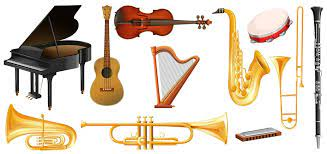

# Musica Clasica

## Introduccion

La música clásica es un género que ha perdurado a lo largo de los siglos, caracterizado por su riqueza histórica y diversidad de estilos. Desde las majestuosas sinfonías de Beethoven hasta las delicadas composiciones de Chopin, la música clásica sigue cautivando a oyentes de todas las edades en todo el mundo.

## Instrumentos Caracteristicos
La música clásica se construye sobre la combinación de varios instrumentos. Desde el violín hasta el piano, cada uno desempeña un papel único en la creación de las obras clásicas. algunos de los instrumentos mas caracteristicos de este genero son:
### Instrumentos de Cuerda
   - Violín
   - Viola
   - Violincello
   - Piano
   - Arpa

### Instrumentos de Viento
   - Flauta travesera
   - Oboe
   - Clarinete

## Grandes compositores
A lo largo de la historia, han surgido numerosos compositores que han dejado una huella imborrable en el mundo de la música clásica. Entre ellos, podemos destacar a:

### Ludwig van Beethoven (1770-1827):
Compositor alemán, considerado uno de los más grandes de todos los tiempos. Su obra se caracteriza por su innovación y expresividad, y abarca diversos géneros como la sinfonía, el concierto, la sonata y la ópera.
https://en.wikipedia.org/wiki/Ludwig_van_Beethoven

### Wolfgang Amadeus Mozart (1756-1791):
Compositor austriaco, reconocido por su prolífica producción musical y su dominio de diversos estilos. Entre sus obras más famosas se encuentran la ópera "Don Giovanni", la Sinfonía n.º 40 en sol menor y el Concierto para piano n.º 21 en do mayor.
https://www.britannica.com/biography/Wolfgang-Amadeus-Mozart

### Johann Sebastian Bach (1685-1750):
Compositor alemán, considerado uno de los padres de la música clásica. Su obra se caracteriza por su complejidad armónica, melódica y contrapuntística, y abarca géneros como la cantata, la suite, el concierto y la fuga.
https://en.wikipedia.org/wiki/Johann_Sebastian_Bach

## Mejores composiciones

### La Novena Sinfonía de Ludwig van Beethoven:

Compositor: Ludwig van Beethoven
Año: 1824
Enlace de YouTube: https://www.youtube.com/watch?v=t3217H8JppI

### Las Cuatro Estaciones de Antonio Vivaldi:

Compositor: Antonio Vivaldi
Año: 1725
Enlace de YouTube: https://m.youtube.com/watch?v=7DBIR30ks64

### El Mesías de Georg Friedrich Händel:

Compositor: Georg Friedrich Händel
Año: 1741
Enlace de YouTube: https://m.youtube.com/watch?v=1Sh1bmwZnAw

### El Bolero de Maurice Ravel:

Compositor: Maurice Ravel
Año: 1928
Enlace de YouTube: https://www.youtube.com/watch?v=E9PiL5icwic

