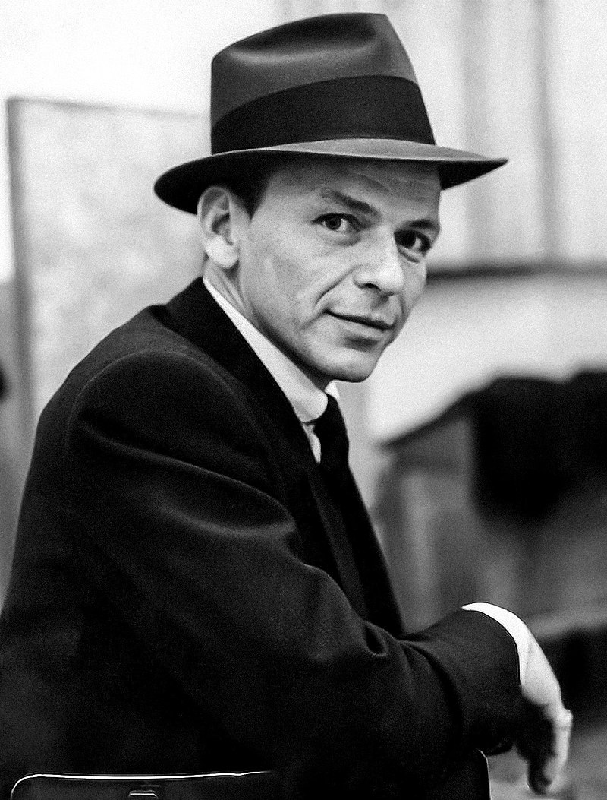
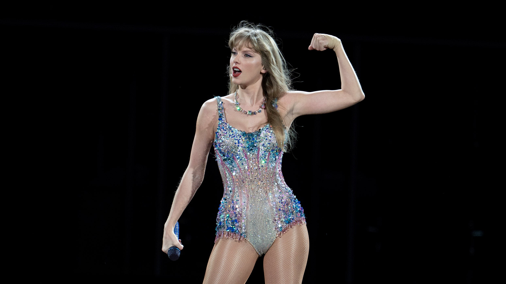
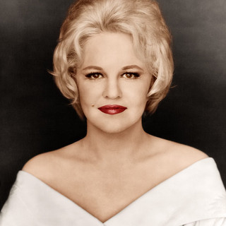
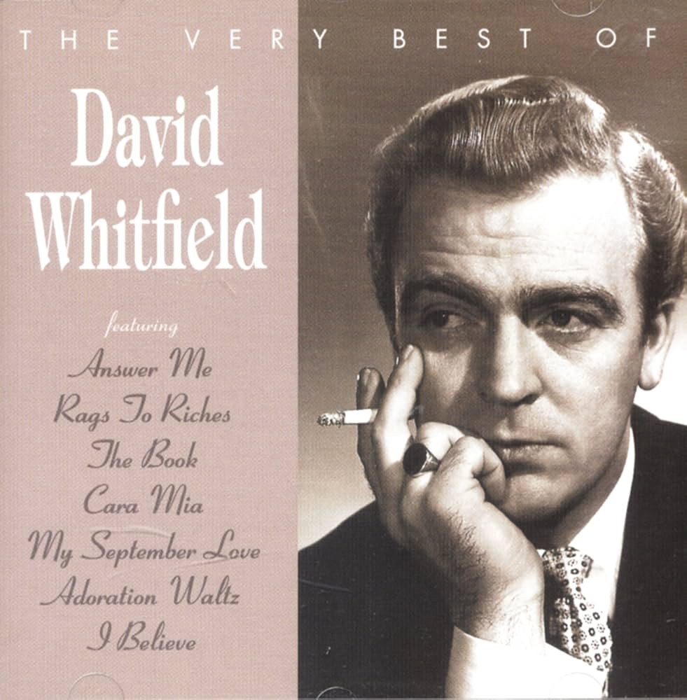

## **_Pop_**

El pop viene de la abreviación de “popular music” la misma hace referencia a los sonidos, temas y melodías para el publico en masa.  Que generalmente se caracterizan por el uso de las composiciones sencillas, los ritmos ligeros y melodías pegadizas 

## **_Historia del pop_**

Se origina a finales de los años 1950 siendo una combinación de  distintos géneros musicales que estaban a la mano en aquel momento, a lo largo de su existencia la musica pop absorbido distintas influencias de la mayoría de otros géneros populares y a contado con imaginables referentes tales como Madrona y Bing Crosby siendo considerados Reyes del pop por su gran influencia en el genero.
La vigencia de este genero es git debido a los grandes cambios que viven día día ya que se va modificando dependiendo de lo popular 

##  _**Los referentes del pop**_  

	1. Michael Jackson

	2. Madonna 

	3. Bing Crosby

	4. Lady gaga 
!

	5. Ariana Grande
!

	6. Frank Sinatra

	7. Taylor Swift

	8. Peggy Lee

	9. Patti Page

	10. David Whitfield

## _**Impacto en las masas**_

Como se ha mencionado el pop es uno de los de los géneros mas escuchados como consecuencia  este fue causante de varios logros tales como tendencias y rompedora de récords estas son algunas de las canciones mas escuchadas y que impactaron de manera notable a la industria

    1. Good vibrations- The Beach Boys
https://www.youtube.com/watch?v=apBWI6xrbLY

	2. Material Girl- Madonna
https://www.youtube.com/watch?v=3j4jx9jGei4
    
	3. Dancing queen- ABBA
https://www.youtube.com/watch?v=xFrGuyw1V8s

    4. Yesterday- The Beatles
https://www.youtube.com/watch?v=wXTJBr9tt8Q

    5. Bohemian rhapsody- Queen
https://www.youtube.com/watch?v=fJ9rUzIMcZQ

    6. Staying alive- Bee Gees
https://www.youtube.com/watch?v=fNFzfwLM72c

    7. Hotel California- Eagles
https://www.youtube.com/watch?v=09839DpTctU

    8. Your song- Elton John
https://www.youtube.com/watch?v=FT3D1Cu6g10

    9. Thriller- Michael Jackson
https://www.youtube.com/watch?v=sOnqjkJTMaA

    10. When doves cry- Prince
https://www.youtube.com/watch?v=UG3VcCAlUgE

## **_Fuentes:_**

https://www.timeout.es/madrid/es/musica/las-20-mejores-canciones-pop-de-la-historia

