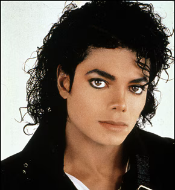
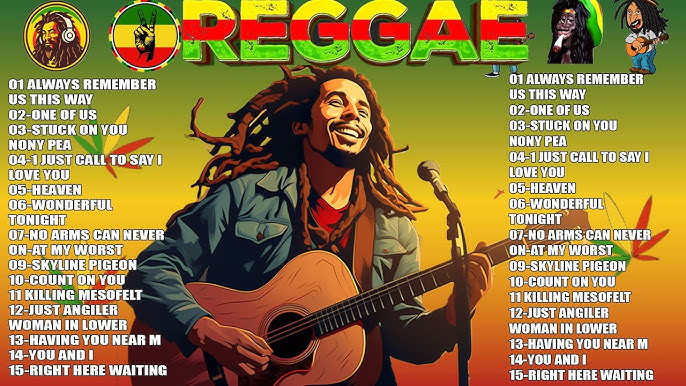
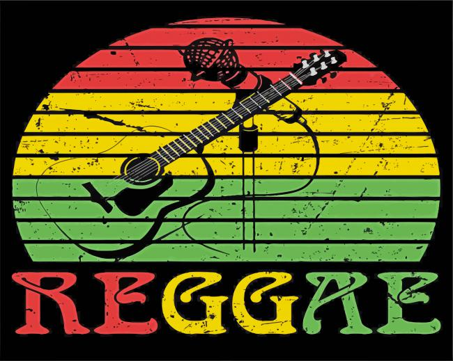

## Reggae Información

## La historia del Reggae
El reggae surgió como estilo en la década de los 1960. Los ritmos de ska y rocksteady ya establecidos en Jamaica se desaceleraron y, manteniendo su énfasis en el contratiempo, se combinaron con influencias primariamente de Estados Unidos como el doo-wop, country, soul, blues y rock.
## Cultura e impacto
Está estrechamente vinculado con el movimiento rastafari, que influye en las temáticas de muchas canciones (paz, unidad, justicia social).
El reggae también aborda temas sociales y políticos, siendo una forma de expresión cultural.
Bob Marley se considera el máximo exponente del reggae a nivel mundial, llevando su mensaje a todo el planeta.

## Principales artistas del género

- Bob Marley                                                                                                                                                                                                                                                                            

- Peter Tosh
- Gondwana
- Cultura Profética
- Los Cafres
- Morodo

## Las 15 mejores canciones del reggae
- I Shot The Sheriff – Bob Marley & the Wailers
- Many Rivers To Cross – Jimmy Cliff
- I Can See Clearly Now – Johnny Nash
- You Can Get It If You Really Want – Jimmy Cliff
- Israelites – Desmond Dekker & the Aces
- No Woman, No Cry – Bob Marley & the Wailers

## Características musicales
Su ritmo distintivo se basa en un contrapunto entre el golpe fuerte del bajo y la batería con la sección rítmica fuera de tiempo.  Suele tocarse a un tempo lento o moderado, creando una sensación relajada y positiva.
Las guitarras suelen tocar patrones rítmicos o líneas de acordes simples.

## Imágenes del reggae

## Bibliografía
- https://facartes.uniandes.edu.co/patrimonio/reggae-patrimonio/#:~:text=El%20reggae%20surgi%C3%B3%20como%20estilo,%2C%20soul%2C%20blues%20y%20rock.
- https://www.univision.com/entretenimiento/cultura-pop/17-artistas-que-hicieron-que-el-reggae-fuese-mas-comercial
- https://www.plasticosydecibelios.com/las-15-mejores-canciones-del-reggae/
- https://www.wipo.int/wipo_magazine/es/2016/03/article_0004.html

